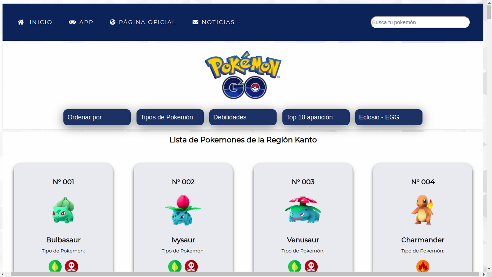
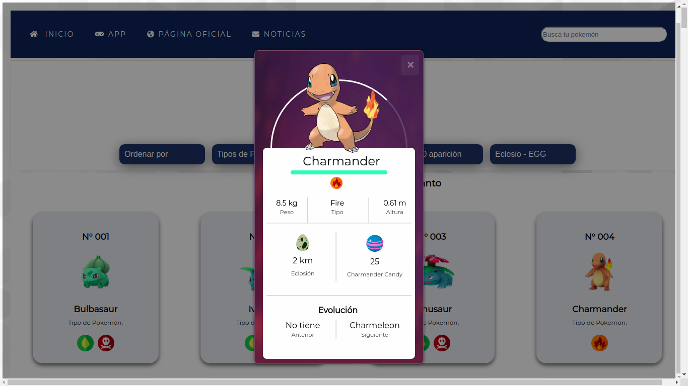
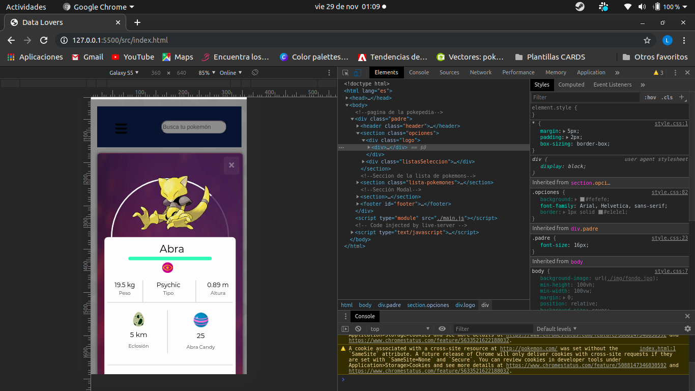

# Data Lovers

## Índice

* [1. Preámbulo](#1-preámbulo)
* [2. Resumen del proyecto](#2-resumen-del-proyecto)
* [3. Objetivos de aprendizaje](#3-objetivos-de-aprendizaje)
***

## 1. Preámbulo

Según [Forbes](https://www.forbes.com/sites/bernardmarr/2018/05/21/how-much-data-do-we-create-every-day-the-mind-blowing-stats-everyone-should-read),
el 90% de la data que existe hoy ha sido creada durante los últimos dos años.
Cada día generamos 2.5 millones de terabytes de datos, una cifra sin precedentes.

No obstante, los datos por sí mismos son de poca utilidad. Para que esas
grandes cantidades de datos se conviertan en **información** fácil de leer para
los usuarios, necesitamos entender, procesar y mostrar estos datos. Una manera
simple de hacerlo es creando _interfaces_ y _visualizaciones_.

## 2. Resumen del proyecto

En este proyecto se ha construido una _página web_ que permita a los usuarios de _Pokemon Go!_ consultar el listado completo de los Pokémons de la región Kanto. Para ello, pueden visualizar un
_conjunto (set) de datos provenientes de Pokemon Go!_ del cual se ha adecuado según las necesidades del usuario.

Como entregable final se presenta una página web que permite a los usuarios
**mostrar, filtrar, ordenar y buscar**.

A continuación se muestra el resultado final de la página

#### Imagen del proyecto

Captura del proyecto en pantalla Desktop.





Captura del proyecto en pantalla para Celular.



### Los datos utilizados provienen de la siguiente información:

* [Pokémon](src/data/pokemon/pokemon.json):
  El cual contiene una lista con los 151 Pokémon de la región de Kanto

  [Pokémon GO](http://pokemongolive.com).


## 3. Investigación UX de Pokémon Go.

Primero se ha realizado una encuesta de usabilidad del juego, a un grupo de 5 personas aproximadamente, de quienes se ha podído recabar las siguiente información:

#### 1. Descubrimiento e investigación
Al inicio se ha realizado a un grupo de 9 personas, una consulta si conocen o no la aplicación de Pokemon go!, de quienes se ha podido encontrar que 6 afirmaron habar usado la aplicación de Pokemon Go! y 3 manifestaron que no les agradaba la aplicación.

#### 2. Sistensis y definición

El usuario objetivo son los jugadores de la aplicación móvil Pokémon Go.

- Para la realización del proyecto se ha recurrio al testeo con tres usuarios.
- tres de ellos eran jugadores frencuentes de la aplicación PokemonGo y los demás conocían la aplicación pero habían dejado de jugar.
- Se preguntó a todos ellos cual es la información más importante que ellos necesitan encontrar en el aplicativo.
- En base a la información realizada, se procedió a realizar un testeo a través de un prototipo de baja fidelidad, donde nos señalaron los elementos que identificaron. De acuerdo a estos comentarios, se decidio realizar cambios y mejoras para realizar el primer producto entregable.
- Para una segunda entrebista, se a traves de los colaboradores, se identificaron algunas acciones e información que los usuarios reconocían como información que ellos buscaban o creian mas relevante.
- Así mismo, también se obtuvo feeback del squad (compañeras de laborattoria) y coach.

A continuación se muestra el prototipado en baja fidelidad.

#### Imagenes


#### 3. Historias de Usuario.

A partir de la información proporcionada, se ha obtenido las siguientes Hitorias de Usuario.:

#### SPRINT 1
>Historia 1: Quiero poder ver a todos los pokemones al ingresar a la página para saber toda la información sobre ellos.
#### Criterio de aceptación.
- [x] Se debe visualizar a todos los pokemones.
- [x] Por pokemón se debe de visualizar el nombre y numero respectivo.
- [x] La ventana de los pokemones debe de tener los filtros de tipo, debilidad, ordenar por tipos y un buscador.

>Historia 2: Como usuaria quiero poder elegir un pokemon para ver sus características más relevantes.

#### Criterio de aceptación
- [x] Al seleccionar a un pokemon se debe mostrar un modal.
- [x] En la ventana de emergente se debe de visualizar las características relevantes.
- [x] Las características se tiene que visualizar debajo de la imagen del pokemon seleccionado.
- [x] La ventana emergente o modal, tiene que tener la opción de cerrar.

#### SPRINT 2
>Historia 3: Quiero poder obtener ordenar la lista de los pokemones de (A-Z, Z-A) para tener una visualización  por nombre del cada pokemon.

#### Criterio de aceptación
- [x] Al filtrar la opción de ordenar por A-Z se debe mostrar los pokemones en ese orden.
- [x] Al filtrar la opción de ordenar por Z-A se debe mostrar los pokemones en ese orden.
- [x] Al filtrar la opción de ordenar por 1-152 se debe mostrar los pokemones en ese orden.

#### SPRINT 3

>Historia 4: Como Usuario quiero poder  filtrar por tipo los pokemones.

#### Criterio de aceptación
- [x] El usuario tenga la opción del filtro.
- [x] El usuario al seleccionar el filtro por tipo se despliegue toda los tipos de pokemón.
- [x] El usuario pueda seleccionar cualquier tipo de pokemon.
- [x] El usuario al seleccionar un tipo se visualice los pokemones correspondientes.
- [x] El usuario pueda visualizar el total de los pokemones segun el filtro.
- [x] Que el usuario luego de realizar el filtro por tipo pueda filtrar todo los pokemones.
- [x] Que la lista de cada pokemon al hacer clic se pueda ver las características relevantes.

> Historia 5: Quiero poder  filtrar por debilidades de los pokemones.

#### Criterio de aceptación
- [x] Que los pokemones se visualice por tipo de debilidad.
- [x] Que nos muestre los pokemones que son débiles con otros de diferente tipo.

> Historia 6s: Como usuario quiero obtener el porcentaje de los pokemones que aparecen en los diferentes tipos de huevo para saber que huevos eclosionar.

#### Criterio de aceptación
- [x] El usuario tenga la opción la opción del filtro por huevo.
- [x] El usuario al seleccionar el filtro por tipo de huevo según km se desplegue toda las opciones.
- [x] El usuario pueda seleccionar cualquier tipo de km de pokemón.
- [x] El usuario al seleccionar cualquier km de huevo se visualice los pokemones correspondientes.
- [x] El usuario pueda visualizar el % según el km seleccionado.
- [x] Que la lista de cada pokemon al hacer clic se pueda ver las características relevantes.

#### 4. Prototipado de Alta fidelidad:

A traves de la Herramienta Figma se ha podido realizar un prototipo de alta fidelidad, el cual se puede visualizar en los siguientes Links:

Para Desktop:

https://www.figma.com/proto/xLYlIf49aQz5QCm0jkfZEL/Pokepedia?node-id=90%3A2&scaling=scale-down

Para equipos móviles:

https://www.figma.com/proto/xLYlIf49aQz5QCm0jkfZEL/Pokepedia?node-id=100%3A11&scaling=scale-down


## 4. Objetivos de aprendizaje

El objetivo principal de este proyecto es que, entendiendo las necesidades de
tus usuarios, aprendas a diseñar y construir una interfaz web donde se pueda
visualizar y manipular data.

Revisa la lista y reflexiona sobre los objetivos que conseguiste en el
proyecto anterior. Piensa en eso al decidir tu estrategia de trabajo individual
y de equipo.

### UX

- [X] Diseñar la aplicación pensando y entendiendo al usuario.
- [ ] Crear prototipos para obtener _feedback_ e iterar.
- [X] Aplicar los principios de diseño visual (contraste, alineación, jerarquía).
- [X] Planear y ejecutar _tests_ de usabilidad.

### HTML y CSS

- [X] Entender y reconocer por qué es importante el HTML semántico.
- [X] Identificar y entender tipos de selectores en CSS.
- [X] Entender como funciona `flexbox` en CSS.
- [ ] Construir tu aplicación respetando el diseño planeado (maquetación).

### DOM

- [X] Entender y reconocer los selectores del DOM (querySelector | querySelectorAll).
- [X] Manejar eventos del DOM. (addEventListener)
- [X] Manipular dinámicamente el DOM. (createElement, appendchild, innerHTML, value)

### Javascript

- [X] Manipular arrays (`filter` | `map` | `sort` | `reduce`).
- [X] Manipular objects (key | value).
- [X] Entender el uso de condicionales (`if-else` | `switch`).
- [X] Entender el uso de bucles (`for` | `forEach`).
- [X] Entender la diferencia entre expression y statements.
- [X] Utilizar funciones (parámetros | argumentos | valor de retorno).
- [X] Entender la diferencia entre tipos de datos atómicos y estructurados.
- [X] Utilizar ES Modules (`import` | `export`).

### Pruebas Unitarias (_testing_)
- [X] Testear funciones (funciones puras).

### Git y GitHub
- [X] Ejecutar comandos de git (`add` | `commit` | `pull` | `status` | `push`).
- [X] Utilizar los repositorios de GitHub (`clone` | `fork` | gh-pages).
- [ ] Colaborar en Github (pull requests).

### Buenas prácticas de desarrollo
- [X] Organizar y dividir el código en módulos (Modularización).
- [X] Utilizar identificadores descriptivos (Nomenclatura | Semántica).
- [X] Utilizar linter para seguir buenas prácticas (ESLINT).

#### Estructura:

```text
.
├── pokemon
|  ├── README.md
├── src
|  ├── data (según con qué data trabajes)
|  |  ├── pokemon
|  |  |  ├── pokemon.js
|  |  |  └── pokemon.json
|  ├── data.js
|  ├── index.html
|  ├── main.js
|  └── style.css
├── test
|  ├── data.spec.js
├── README.md
└── package.json

directory: 9 file: 16
```
